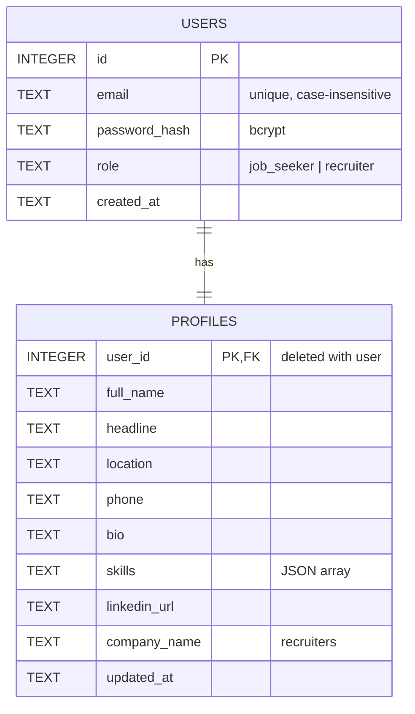

# Database schema

SQLite, created automatically by `server/src/db.js` on first start (`CREATE TABLE IF NOT EXISTS`).

Design notes:
- One profile per user, created in the same transaction as the account, so a user never exists without a profile.
- `email` uses `COLLATE NOCASE` so `Sam@x.com` and `sam@x.com` are the same account.
- `role` is limited by a `CHECK` constraint to the two supported user types.
- Passwords are stored only as bcrypt hashes.
- The `resumes` table is added by US-04.
